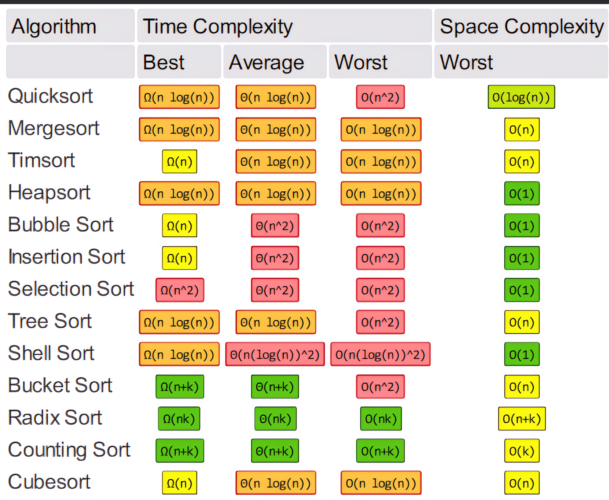
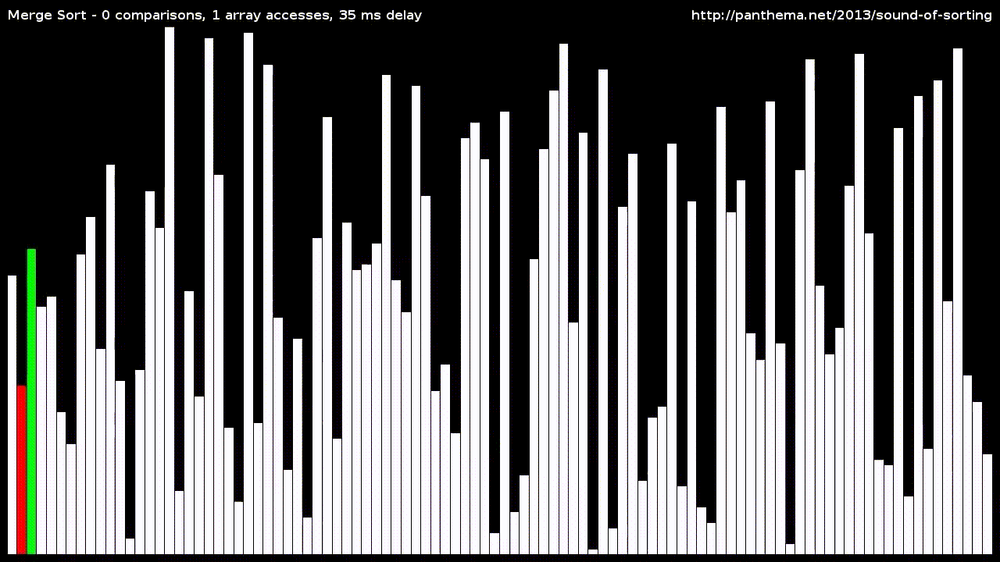
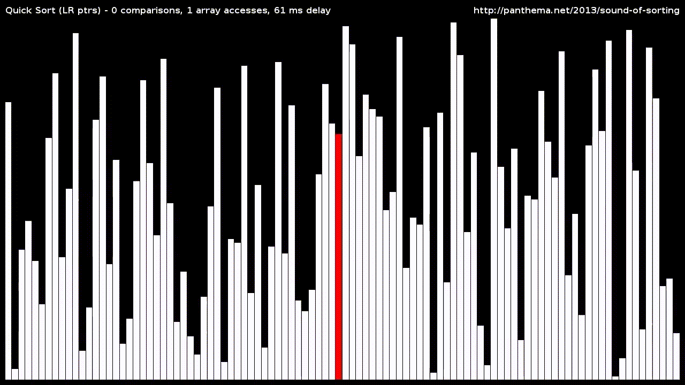
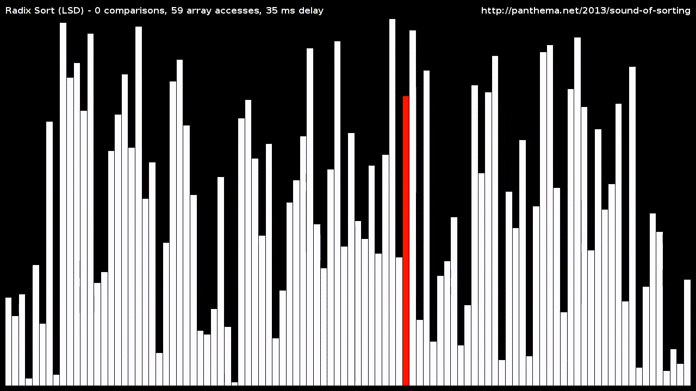

# MASTERING THE SORTING ALGORITHMS

Welcome to the Sorting Algorithms repository! 🎉

Sorting algorithms are fundamental concepts in computer science, used to rearrange items in a certain order in a dataset. This repository contains a collection of popular sorting algorithms implemented in various programming languages. From the classic Bubble Sort to the efficient Quick Sort, you'll find everything you need to get started with sorting data. Each algorithm is accompanied by detailed explanations and examples to help you understand how it works. So, whether you're a beginner or an experienced programmer, this repository is for you! Let's dive into the world of sorting! 🔍

## Getting Started

To get started, simply navigate to the language-specific directories (C++, Java, Python and Javascript) and explore the sorting algorithm implementations. Each algorithm comes with its code, explanations, and associated articles. Feel free to modify, experiment, and learn from these implementations.

## Table of Contents

1. [Introduction](#introduction)
2. [Getting Started](#getting-started)
3. [Sorting Algorithms](#sorting-algorithms)
   - [Bubble Sort](#Bubble-sort-➡️)
   - [Selection Sort](#Selection-sort-➡️)
   - [Insertion Sort](#Insertion-sort-➡️)
   - [Merge Sort](#Merge-sort-➡️)
   - [Quick Sort](#Quick-sort-➡️)
   - [Count Sort](#Count-sort-➡️)
   - [Heap Sort](#Heap-sort-➡️)
   - [Radix Sort](#Radix-sort-➡️)
   - [Shell Sort](#Shell-sort-➡️)
   - [Tim Sort](#Tim-sort-➡️)
   - [Bucket Sort](#Bucket-sort-➡️)
   - [Cube Sort](#Cube-sort-➡️)
4. [Contributing](#contributing)
5. [Resources](#resources)
6. [License](#license)

## Introduction

Sorting algorithms are essential tools in a programmer's toolkit. They allow us to arrange elements in a specific order, making data manipulation and retrieval more efficient. This repository aims to provide a comprehensive collection of sorting algorithms implemented in C++, Java, Python, and JavaScript, along with detailed explanations and resources to deepen your understanding.

## Big-O Notation

**Big O Notation** is a mathematical way to analyze and express the efficiency of algorithms. It quantifies how the performance of an algorithm scales with the size of its input. In simple terms, it provides an upper bound on the worst-case time or space complexity of an algorithm, helping programmers and engineers make informed choices when designing and selecting algorithms for various tasks.

## Sorting Algorithms

### Bubble Sort [➡️](https://en.wikipedia.org/wiki/Bubble_sort)

Bubble sort is a simple sorting algorithm that repeatedly steps through the list, compares adjacent elements, and swaps them if they are in the wrong order, gradually moving the larger elements towards the end. It's easy to understand but not efficient for large datasets.

- [C++ Implementation](C++/bubble_sort.cpp)
- [Java Implementation](Java/BubbleSort.java)
- [Python Implementation](Python/bubble_sort.py)
- [JavaScript Implementation](Javascript/bubble_sort.js)
- [Article: Understanding Bubble Sort](Articles/bubble_sort.pdf)
- [Notes: Bubble Sort](Notes/BubbleSort.pdf)

### Selection Sort [➡️](https://en.wikipedia.org/wiki/Selection_sort)

Selection sort is a straightforward sorting algorithm that divides the input into a sorted and an unsorted region, iteratively selecting the smallest element from the unsorted portion and moving it to the sorted section. While simple to implement, it's not the most efficient choice for large datasets.

- [C++ Implementation](C++/selection_sort.cpp)
- [Java Implementation](Java/SelectionSort.java)
- [Python Implementation](Python/selection_sort.py)
- [JavaScript Implementation](Javascript/selection_sort.js)
- [Article: Selection Sort Explained](Articles/selection_sort.pdf)
- [Notes: Selection Sort](Notes/SelectionSort.pdf)

### Insertion Sort [➡️](https://en.wikipedia.org/wiki/Insertion_sort)

Insertion sort is a simple sorting algorithm that builds the final sorted array one item at a time, inserting each element into its correct position. It's efficient for small datasets and partially sorted lists.

- [C++ Implementation](C++/insertion_sort.cpp)
- [Java Implementation](Java/InsertionSort.java)
- [Python Implementation](Python/insertion_sort.py)
- [JavaScript Implementation](Javascript/insertion_sort.js)
- [Article: Mastering Insertion Sort](Articles/insertion_sort.pdf)
- [Notes: Insertion Sort](Notes/InsertionSort.pdf)

### Merge Sort [➡️](https://en.wikipedia.org/wiki/Merge_sort)

Merge sort is a divide-and-conquer sorting algorithm that divides an array into smaller subarrays, recursively sorts them, and then merges the sorted subarrays to produce a sorted result. It offers a stable and efficient way to sort large datasets.

- [C++ Implementation](C++/merge_sort.cpp)
- [Java Implementation](Java/MergeSort.java)
- [Python Implementation](Python/merge_sort.py)
- [JavaScript Implementation](Javascript/merge_sort.js)
- [Article: Dive into Merge Sort](Articles/merge_sort.pdf)
- [Notes: Merge Sort](Notes/MergeSort.pdf)

### Quick Sort [➡️](https://en.wikipedia.org/wiki/Quicksort)

Quick sort is a fast and efficient divide-and-conquer sorting algorithm that selects a "pivot" element and partitions the array into two subarrays, one with elements smaller than the pivot and the other with elements greater. It repeatedly applies this process recursively, making it one of the fastest sorting algorithms for most scenarios.

- [C++ Implementation](C++/quick_sort.cpp)
- [Java Implementation](Java/QuickSort.java)
- [Python Implementation](Python/quick_sort.py)
- [JavaScript Implementation](Javascript/quick_sort.js)
- [Article: Quick Sort Demystified](Articles/quick_sort.pdf)
- [Notes: Quick Sort](Notes/QuickSort.pdf)

### Count Sort [➡️](https://en.wikipedia.org/wiki/Counting_sort)

Counting sort is a non-comparative integer sorting algorithm that works by counting the frequency of each element in the input data and using that information to place elements in their correct sorted positions. It's highly efficient for sorting integers within a specific range.

- [C++ Implementation](C++/CountSort.cpp)
- [Java Implementation](Java/CountSort.java)
- [Python Implementation](Python/CountSort.py)
- [JavaScript Implementation](Javascript/CountSort.js)
- [Article: Quick Sort Demystified](Articles/CountSort.pdf)
- [Notes: Count Sort](Notes/CountSort.pdf)

### Heap Sort [➡️](https://en.wikipedia.org/wiki/Heapsort)

Heap sort is a comparison-based sorting algorithm that builds a binary heap data structure, repeatedly extracts the maximum element from it (for ascending order), and places it in the sorted portion of the array. It offers a stable and efficient way to sort large datasets.

- [C++ Implementation](C++/HeapSort.cpp)
- [Java Implementation](Java/HeapSort.java)
- [Python Implementation](Python/HeapSort.py)
- [JavaScript Implementation](Javascript/heapSort.js)
- [Article: Understanding Heap Sort](Articles/HeapSort.pdf)
- [Notes: Heap Sort](Notes/HeapSort.pdf)

### Radix Sort [➡️](https://en.wikipedia.org/wiki/Radiorgx_sort)

Radix sort is a non-comparative sorting algorithm that works by distributing elements into buckets based on individual digits or characters in their representation, then repeatedly collecting and concatenating the buckets. It's particularly efficient for sorting strings and integers with fixed-length representations.

- [C++ Implementation](C++/radix_sort.cpp)
- [Java Implementation](Java/RadixSort.java)
- [Python Implementation](Python/radix_sort.py)
- [JavaScript Implementation](Javascript/radix_sort.js)
- [Article: Radix Sort Unleashed](Articles/radix_sort.pdf)
- [Notes: Radix Sort](Notes/RadixSort.pdf)

### Shell Sort [➡️](https://en.wikipedia.org/wiki/Shell_sort)

Shell sort, also known as diminishing increment sort, is a variation of insertion sort that divides the input into smaller subarrays and sorts them individually using insertion sort with progressively larger gap values. It strikes a balance between simplicity and efficiency, making it suitable for medium-sized datasets.

- [C++ Implementation](C++/ShellSort.cpp)
- [Java Implementation](Java/ShellSort.java)
- [Python Implementation](Python/ShellSort.py)
- [JavaScript Implementation](Javascript/ShellSort.js)
- [Article: Radix Sort Unleashed](Articles/ShellSort.pdf)
- [Notes: Radix Sort](Notes/ShellSort.pdf)

### Tim Sort [➡️](https://en.wikipedia.org/wiki/Timsort)

Tim sort is a hybrid sorting algorithm derived from merge sort and insertion sort. It's designed for practical efficiency and is the default sorting algorithm in many programming languages, including Python and Java, due to its adaptability and performance.

- [C++ Implementation](C++/TimSort.cpp)
- [Java Implementation](Java/TimSort.java)
- [Python Implementation](Python/TimSort.py)
- [JavaScript Implementation](Javascript/TimSort.js)
- [Article: Radix Sort Unleashed](Articles/TimSort.pdf)
- [Notes: Radix Sort](Notes/TimSort.pdf)

### Bucket Sort [➡️](https://en.wikipedia.org/wiki/Bucket_sort)

Bucket sort is a sorting algorithm that distributes elements into a finite number of buckets, then individually sorts each bucket, often using another sorting algorithm. It's particularly efficient for sorting uniformly distributed data, like integers or floating-point numbers.

- [C++ Implementation](C++/BucketSort.cpp)
- [Java Implementation](Java/BucketSort.java)
- [Python Implementation](Python/BucketSort.py)
- [JavaScript Implementation](Javascript/BucketSort.js)
- [Article: Radix Sort Unleashed](Articles/BucketSort.pdf)
- [Notes: Radix Sort](Notes/BucketSort.pdf)

### Cube Sort [➡️](https://en.wikipedia.org/wiki/Cube_sort)

Cube sort, also known as block sort, is an efficient in-place sorting algorithm that divides the input into blocks, sorts the blocks using another sorting algorithm, and merges them. It's known for its stability and is well-suited for sorting large datasets.

- [C++ Implementation](C++/CubeSort.cpp)
- [Java Implementation](Java/CubeSort.java)
- [Python Implementation](Python/CubeSort.py)
- [JavaScript Implementation](Javascript/CubeSort.js)
- [Article: Radix Sort Unleashed](Articles/CubeSort.pdf)
- [Notes: Radix Sort](Notes/CubeSort.pdf)

## Articles

The following articles are included in this repository:

- [A Beginner's Guide to Sorting Algorithms](https://www.tutorialspoint.com/sorting_algorithms/sorting_algorithms_tutorial.htm)
- [The Best Sorting Algorithm for Your Needs](https://www.toptal.com/algorithms/sorting-algorithms)
- [How to Implement a Sorting Algorithm in Your Own Code](https://www.geeksforgeeks.org/implementing-sorting-algorithms-in-python/)
- [Sorting Algorithms in Depth](https://www.coursera.org/specializations/sorting-algorithms)

## Resources

In addition to the code and articles in this repository, here are some external resources to further your understanding of sorting algorithms:

- [Sorting Algorithm Visualizer](https://visualgo.net/en/sorting)
- [Sorting Algorithms: A Visual Guide](https://www.toptal.com/developers/sorting-algorithms)
- [Coursera: Algorithms and Data Structures](https://www.coursera.org/specializations/algorithms)
- [The Sound of Sorting Algorithm cheat sheet](https://panthema.net/2013/sound-of-sorting/)
- [Data Structure Visualization](https://www.cs.usfca.edu/~galles/visualization/ComparisonSort.html)
- [A list of sorting algorithms in different programming languages](https://en.wikipedia.org/wiki/Sorting_algorithm#Implementations_in_programming_languages)

## Contributing

Contributions are always welcome! If you have a new sorting algorithm implementation, an enhancement to an existing one, or an insightful article to share, please feel free to submit a pull request. Be sure to follow the [contribution guidelines](CONTRIBUTING.md) for a smooth collaboration process.

## License

This repository is licensed under the [MIT License](LICENSE), which means you're free to use, modify, and distribute the code and resources for educational and non-commercial purposes.

---

We hope this repository serves as a valuable resource in your journey to mastering sorting algorithms. Happy coding and sorting!

> "In programming, simplicity and clarity are king." - Bjarne Stroustrup
